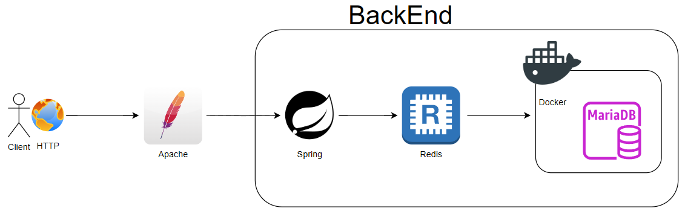

# 프로젝트 개요
이 프로젝트는 동시성 테스트를 목적으로 개발된 쇼핑몰 시스템입니다. 다양한 사용자 요청을 동시에 처리하는 성능과 안정성을 검증하기 위해, 상품 목록 조회, 상품 조회, 상품 추가, 상품 수정, 상품 구매 기능을 포함하고 있습니다.

# 아키텍처

# 개발일지
## 쇼핑몰 스펙
이 섹션에서는 프로젝트의 주요 기능과 요구사항을 설명합니다.
- [**상품 목록 조회**](docs/api/products.md#상품-목록-조회): 모든 상품의 목록을 조회할 수 있습니다.
- **상품 조회**: 특정 상품의 상세 정보를 조회할 수 있습니다.
- [**상품 추가**](docs/api/products.md#상품-추가): 새로운 상품을 목록에 추가할 수 있습니다.
- [**상품 수정**](docs/api/products.md#상품-수정): 기존 상품의 정보를 수정할 수 있습니다.
- [**상품 구매**](docs/api/products.md#상품-구매): 상품을 구매하는 기능을 제공합니다.
- 각 API 엔드포인트에 대한 자세한 설명은 [docs/api/products.md](docs/api/products.md)에서 확인할 수 있습니다.
- **ERD**:

## Swagger

## 동시성 문제
이 프로젝트는 동시성 테스트를 통해 여러 사용자가 동시에 상품을 구매할 때 시스템의 성능과 안정성을 검증합니다.
현재 구매 기능에 대한 동시성 테스트를 수행하였으며, 자세한 내용은 [동시성 테스트 문서](docs/concurrency-issue.md)에서 확인할 수 있습니다.

## 코드 디자인
-  **Service**: 비즈닛그 
-  ****:
-  ****:
