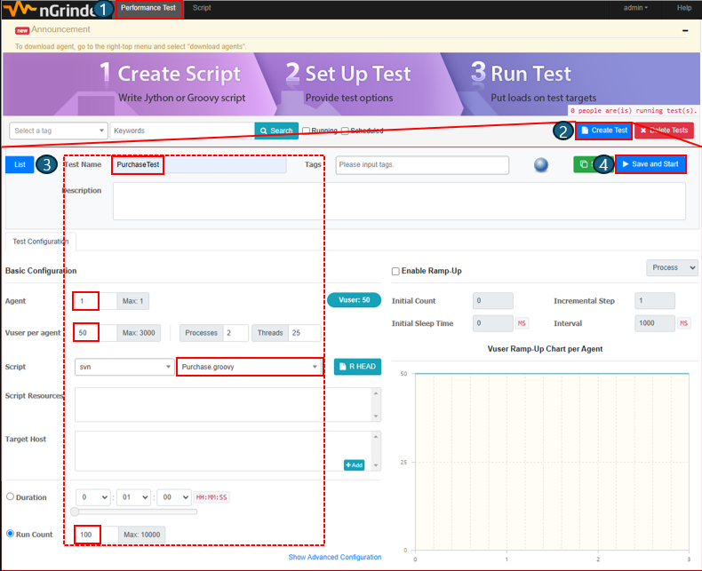
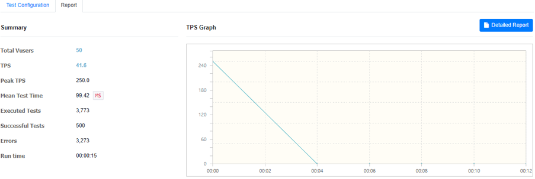

# 소스코드 실행하기

## 1. 소스코드 다운받기


Code > Download ZIP 다운로드 및 압축 풀기

## 2. IntelliJ 로 실행하기


1. 인텔리J 실행하기
2. File > Open

## 3. Docker-compose 실행


services 실행


docker 에서 mariaDB, Redis, nGrinder-controller, nGrinder-agent 확인하기

## 4. 서버 실행


ShoppingmallApplication 실행

## 5. ngrinder 접속
### 5-1. nGrinder 접속 및 Agent 확인하기


인터넷창에 localhost:7070 접속<br>
ID: admin<br>
PW: admin

### 5-2. Test Script 추가하기


1. 상단 [Script] 클릭
2. [Upload]  클릭
3. [파일 선택] 클릭
4. 프로젝트 폴더 > ngrinder > Purchase.groovy 파일 선택
5. [Upload] 클릭

### 5-3. Purchase.groovy IP 수정하기


Docker 의 controller > Inspect 에서 IPAddress 의 IP 주소를 복사하여 Purchase.groovy 41번줄 "ngrinder-controller" 를 지우고 IP 주소 입력


명령프롬프트를 실행하여 'ipconfig' 입력하여 IPv4 의 IP 주소를 복사하여 Purchase.groovy 74번줄 "localhost" 를 지우고 IP 주소 입력

### 5-4. Performance Test 작성 및 실행



1. 상단 [Performance Test] 클릭
2. [Create Test] 클릭
3. Test Name: PurchaseTest, Agent: 1, Vuser per agent: 50, Script: Purchase.groovy, Run Count: 100 작성
4. [Save and Start] 클릭

## 6. 결과 확인
### 6-1. nGrinder Test 결과
 

### 6-2. Docker-MariaDB 주문 결과 및 상품 재고 확인


Docker > db > Exec 탭 클릭
```sql
  mariadb -u root -p  // <Enter>
  Enter password:     // 비밀번호 입력하지 않고 <Enter>
  use shoppingmall;   // <Enter>
  SELECT (SELECT max_stock FROM products WHERE id = 1) AS product_max_stock, (SELECT COUNT(*) FROM orders WHERE product_id = 1) AS order_count;  // <Enter>
```

### 6-3. Redis 상품 주문 개수 확인


Docker > redis > Exec 탭 클릭
```redis
  redis-cli         // <Enter>
  GET productSale:1 // <Enter>
```
