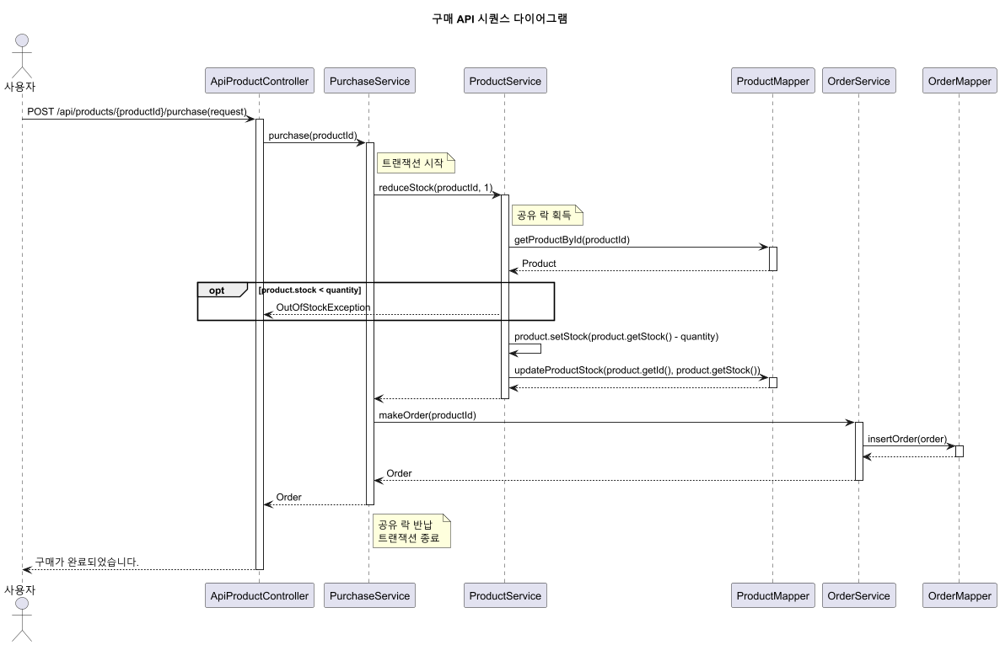
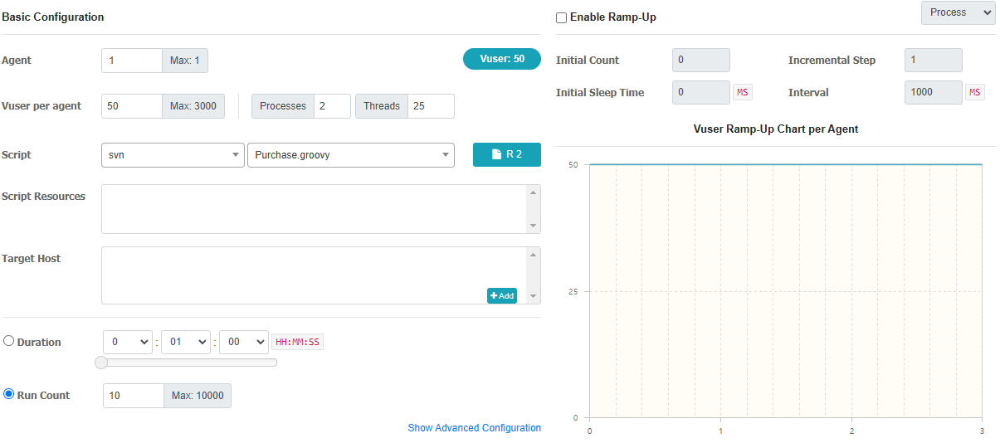
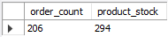
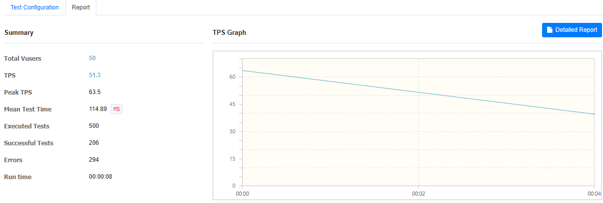
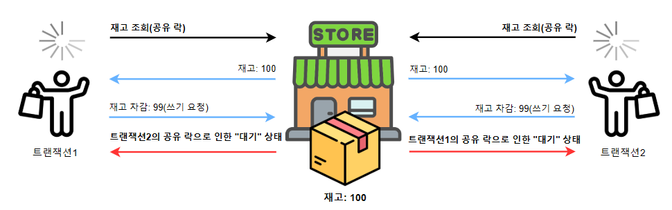
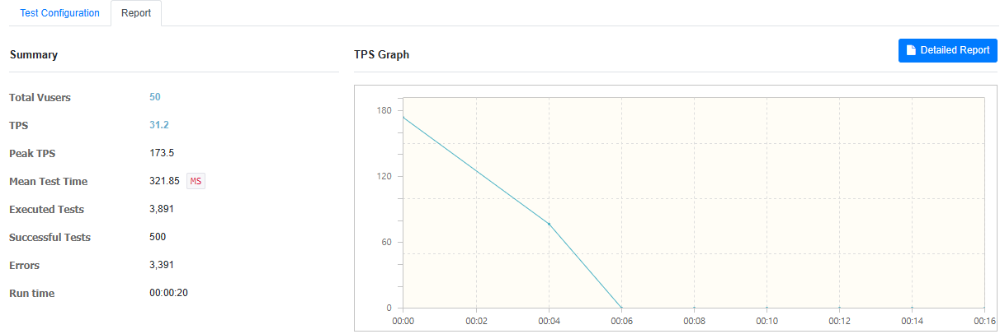

# DB락을 통한 동시성 제어

## 1. DB락이 무엇인가?
다수의 유저가 거의 동시에 하나의 상품을 구매하기 위해 데이터베이스에 접근하는 경합 상태를 방지하여 데이터의 무결성과 일관성을 유지하는 방법입니다.

  - **DB락의 종류**:
    - 공유 락(Shared Lock): 다수의 트랜잭션이 동시에 데이터를 읽을 수 있도록 허용하지만, 이 락이 설정된 데이터는 상품 수정이나 재고 차감을 할 수 없습니다.
    - 배타 락(Exclusive Lock): 특정 트랜잭션이 데이터를 단독으로 사용하게 하며, 이 락이 설정된 데이터는 다른 트랜잭션이 상품 조회, 수정, 재고 차감을 할 수 없습니다.

## 2. 한 번에 한 명만 재고 차감할 수 있도록 설정하기

### 2-1. 트랜잭션 격리 수준(Isolation Level)
| Isolation Level     | Dirty Read | Non-repeatable Read | Phantom Read |
|---------------------|------------|----------------------|--------------|
| Read Uncommitted    | O          | O                    | O            |
| Read Committed      | X          | O                    | O            |
| Repeatable Read     | X          | X                    | O            |
| Serializable        | X          | X                    | X            |
  - **REPEATABLE READ**:
    - MariaDB의 기본 격리 수준입니다.
    - 트랜잭션에서 조회했을 때 일관성 있는 값을 보장하는 격리 수준입니다.
    - Write skew 가 발생할 수 있습니다.
   
  - **SERIALIZABLE**:
    - 가장 엄격한 격리 수준입니다.
    - 트랜잭션을 순차적으로 실행되는 것을 보장합니다.
    - 조회 시 공유 락이 기본 값으로 설정됩니다.

### 2-2. SERIALIZABLE 로 격리 수준 변경하기   
  - **격리 수준 변경**:
    - 공유 락 획득: 이 설정에 따라 모든 조회 시 공유 락을 획득하여 동시성 문제를 방지합니다.
    ```sql
      SET GLOBAL TRANSACTION_ISOLATION = 'SERIALIZABLE';
    ```
  

## 3. 구매 테스트
### 3-1. 테스트 시나리오
  - 쇼핑몰에서 이벤트를 열어서 다수의 유저가 선착순으로 구매하는 상황을 테스트로 진행하였습니다.

### 3-2. nGrinder Setting


### 3-3. 테스트 결과
  - 구매 기록 : 206건의 주문이 기록되었습니다. (구매 성공 비율: 41.2%)
  - 재고 상태: 설정한 재고는 500개였으며, 남은 재고는 294개입니다. (판매된 재고 비율: 41.2%)




### 3-4. 데드락 발생
  - **서버 로그**:
    ```java
      java.sql.SQLException: Deadlock found when trying to get lock; try restarting transaction
    ```
    
### 3-5. 왜 데드락이 발생하게 되었는가?
  1. 거의 동시에 트랜잭션1과 트랜잭션2가 상품을 조회하면서 공유 락을 획득합니다.
  2. 트랜잭션1이 상품 재고를 차감하기 위해 쓰기 요청을 하지만 트랜잭션2의 공유 락으로 인해서 대기하게 됩니다.
  3. 마찬가지로 트랜잭션2가 상품 재고를 차감하기 위해 쓰기 요청을 하지만 트랜잭션1의 공유 락으로 인해서 대기하게 됩니다.
  4. 트랜잭션1과 트랜잭션2가 서로 잠금이 해제되길 기다리면서 교착 상태(Deadlock)에 빠지게 됩니다.


   
### 3-6. 개선 방안
  - 상품 조회 시 공유 락이 아닌 배타 락을 획득하도록 설정하여 한 번에 한 명만 재고를 조회하고 차감할 수 있도록 하면 동시성 문제와 데드락을 해결할 수 있을 것으로 예상됩니다.

## 4. 한 번에 한 명만 재고 조회 및 차감할 수 있게 설정하기

### REPEATABLE READ 로 격리 수준 변경하기   
  - **격리 수준 변경**:
    - 공유 락 해제: 기존의 SERIALIZABLE 격리 수준에서 모든 조회 시 공유 락을 획득하던 것을 REPEATABLE READ로 변경하여 해제하였습니다.
    ```sql
      SET GLOBAL TRANSACTION_ISOLATION = 'REPEATABLE-READ';
    ```
    
  - **한 명만 상품 조회할 수 있게 변경**:
    - 상품 조회 시점부터 배타 락 획득
    ```java
      @Select("SELECT * FROM products WHERE id = #{id} FOR UPDATE")
      Product getProductByIdForUpdate(int id);
    ```
    


## 5. 구매 테스트
### 5-1. 테스트 시나리오
  - 쇼핑몰에서 이벤트를 열어서 다수의 유저가 선착순으로 구매하는 상황을 테스트로 진행하였습니다.

### 5-2. nGrinder Setting


### 5-3. 테스트 결과
  - 구매 기록 : 500건의 주문이 기록되었습니다. (구매 성공 비율: 100%)
  - 재고 상태: 설정한 재고는 500개였으며, 남은 재고는 0개입니다. (판매된 재고 비율: 100%)





### 5-4. TPS 하락
| Metric              | Before (TPS: 91.7) | After (TPS: 31.2) | Change             |
|---------------------|--------------------|--------------------|---------------------|
| Total Vusers        | 50                 | 50                 | -                   |
| TPS                 | 91.7               | 31.2               | **-60.5** (↓)       |
| Peak TPS            | 538                | 173.5              | **-364.5** (↓)      |
| Mean Test Time      | 128.87 MS          | 321.85 MS          | **+192.98 MS** (↑)  |
| Executed Tests      | 4,411              | 3,891              | **-520** (↓)        |
| Successful Tests    | 1,654              | 500                | -                   |
| Errors              | 2,757              | 3,391              | -                   |
| Run time            | 00:00:22           | 00:00:20           | -                   |

- 위의 표를 보면 전체적으로 성능이 약 65.9% 저하된 것을 확인할 수 있습니다.

### 5-5. 왜 성능이 감소하게 되었나?
- REPEATABLE READ 격리 수준에서 배타 락을 사용하면서 동시성 문제 및 데드락 문제는 해결했지만, 이로 인해 여러 트랜잭션들이 락을 획득하기 위해 경합하게 되고, 대기하는 트랙잭션의 수가 증가하게 되면서 전체 시스템의 처리량이 감소하게 되었습니다.


### 5-6. 개선 방안
  - 상품 재고와 같이 구매 기능이 호출될 때 마다 데이터베이스에 접근해서 조회해야 하는 데이터를 메모리 캐시에 저장해두고 데이터베이스에 대한 접근 횟수를 줄여서 응답 시간을 단축시켜 성능 개선이 이루어질 것으로 예상됩니다.

다음편: [레디스 락을 통한 동시성 제어](Redis-Inventory-Control.md)
