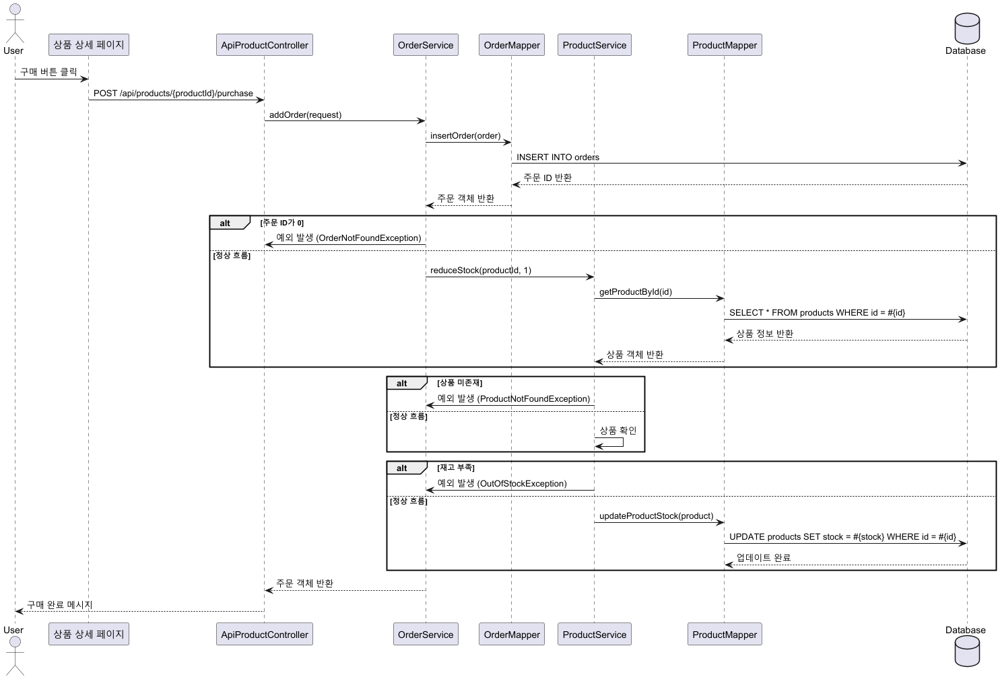
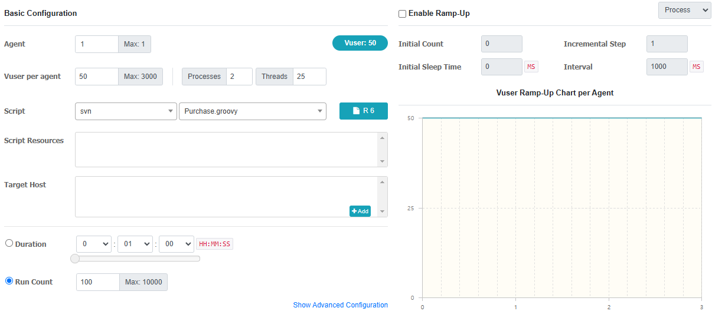
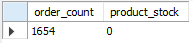
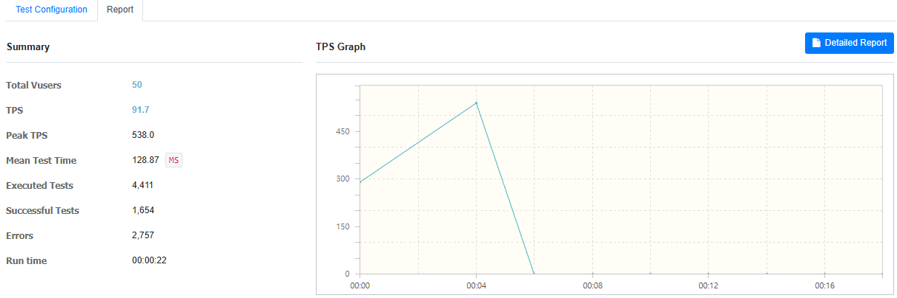
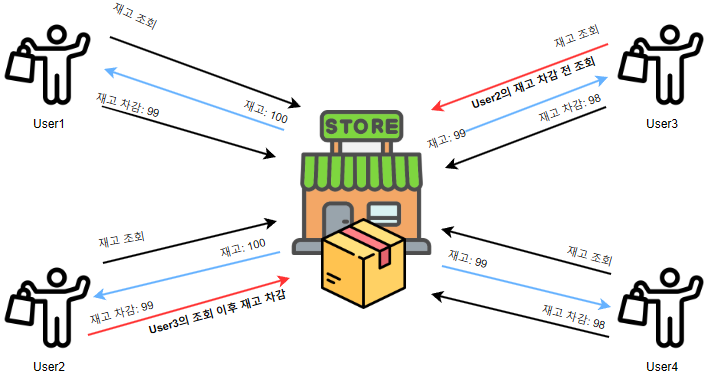

# 동시성 문제

## 1. 구매 기능 구현
  - 구매 API를 개발, 시퀀스는 아래와 같으며 이러한 시퀀스를 통해 구매가 이루어지고 재고가 차감이 됩니다.

## 2. 대규모 구매 테스트

### 1. 테스트 시나리오
  - 쇼핑몰에서 이벤트를 열어서 다수의 유저가 선착순으로 구매하는 상황을 테스트로 진행하였습니다.

### 2. nGrinder Setting       

### 3. 테스트 결과 (동시성 문제 발생)
  - 구매 기록 : 1,654건의 주문이 기록되었습니다. (구매 성공 비율: 약 331%)
  - 재고 상태:  설정한 재고는 500개였으며, 남은 재고는 0개입니다. (판매된 재고 비율: 100%)

### 4. 왜 이런 일이 일어났는가?          
  - **원인**: 다수의 유저가 거의 동시에 같은 시점의 재고 또는 다른 시점의 재고를 조회하게 되어 트랜잭션이 진행되면서 데이터의 일관성이 깨졌습니다. 이로 인해 아래와 같은 이상 현상이 발생했습니다.
  - **이상 현상**: User4가 재고 99에서 1을 차감하여 98로 변경했지만, User3은 재고 100을 조회한 후 1을 차감하여 최종적으로 재고가 99로 돌아오는 Write skew가 발생했습니다.

  

### 5. 개선 방안  
  - 다수의 유저가 거의 동시에 재고를 조회하면서 데이터의 일관성이 깨졌다면, 한 번에 한 명만 재고를 차감할 수 있도록 하면 동시성 문제가 해결될 수 있을 것으로 예상됩니다.

다음편 : DB락을 통한 동시성 제어
